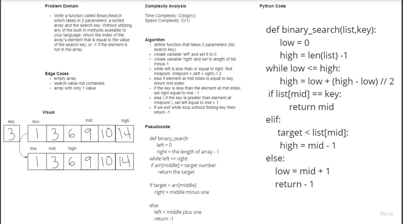

# Binary Search of Sorted Array
Write a function called BinarySearch which takes in 2 parameters: a sorted array and the search key. Without utilizing any of the built-in methods available to your language, return the index of the array’s element that is equal to the value of the search key, or -1 if the element is not in the array.

## Whiteboard Process

## Approach & Efficiency
Time Complexity: O(logN)

The time complexity for our algorithm is O(logN) because for each iteration of the binary search we are dividing the input size by 2. The means that for an input of size N we will have at most log(N) iterations

Space Complexity: O(1)
The space complexity is constant O(1) because the extra space needed to perform this algorithm is constant relative to the input size.