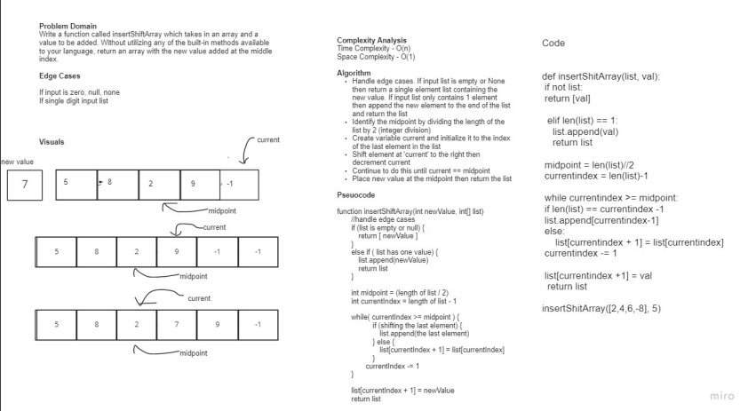

# Array Insert Shift
Write a function called insertShiftArray which takes in an array and a value to be added. Without utilizing any of the built-in methods available to your language, return an array with the new value added at the middle index.


## Example
Input: ```[2,4,6,-8], 5 ```
Output: ``` [2,4,5,6,-8] ```

Input: ``` [42,8,15,23,42], 16 ```
Output: ``` [42,8,15,16,23,42] ```

## Whiteboard Process


## Approach & Efficiency
The approach we used was to identify the midpoint then shift all elements after the midpoint to the right by 1 index. After all elements were shifted we placed the new value at the midpoint.

We'll have to shift 1/2 of the elements of the array so the asymptotic time complexity of this algorithm is O(n)