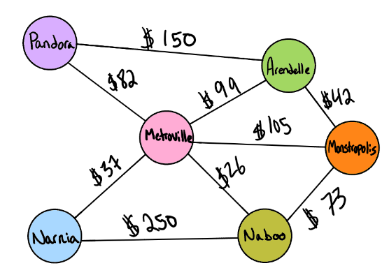
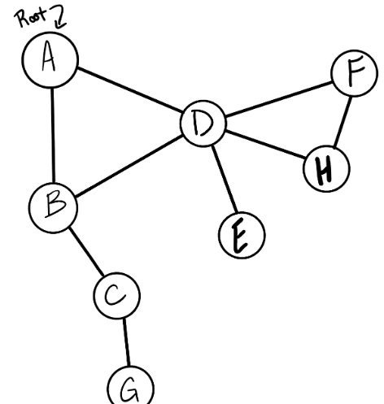

# Implementation: Graphs

## Features

Implement your own Graph. The graph should be represented as an adjacency list, and should include the following methods:

```add node()```
- Arguments: value
- Returns: The added node
- Add a node to the graph

```add edge()```
- Arguments: 2 nodes to be connected by the edge, weight (optional)
- Returns: nothing
- Adds a new edge between two nodes in the graph
- If specified, assign a weight to the edge
- Both nodes should already be in the Graph

```get_nodes()```
- Arguments: none
- Returns all of the nodes in the graph as a collection (set, list, or similar)

```get_neighbors()```
- Arguments: node
- Returns a collection of edges connected to the given node
- Include the weight of the connection in the returned collection

```size()```
- Arguments: none
- Returns the total number of nodes in the graph

```breadth_first()```
- Arguments: Node
- Return: A collection of nodes in the order they were visited using BFS traversal.

```business_trip(cities)```
- Arguments: graph, array of city names
- Return: cost or null

```depth_first(node)```
- Arguments: node
- Return: A collection of nodes in the order they were visited using DFS traversal.

## Structure and Testing

Utilize the Single-responsibility principle: any methods you write should be clean, reusable, abstract component parts to the whole challenge. You will be given feedback and marked down if you attempt to define a large, complex algorithm in one function definition.

Write tests to prove the following functionality:

- Node can be successfully added to the graph
- An edge can be successfully added to the graph
- A collection of all nodes can be properly retrieved from the graph
- All appropriate neighbors can be retrieved from the graph
- Neighbors are returned with the weight between nodes included
- The proper size is returned, representing the number of nodes in the graph
-  A graph with only one node and edge can be properly returned
- An empty graph properly returns null


# Code Challenge 37 - Graph "Business Trip"



| Input | 	Output | 
| --- | --- |
| [Metroville, Pandora, ]	| $82 |
| [Arendelle, New Monstropolis, Naboo] | $115 |
| [Naboo, Pandora]	| $0 |
| [Narnia, Arendelle, Naboo] | $0 |

# Code Challenge 38 - Graph depth-first search



Output: [A, B, C, G, D, E, H, F]