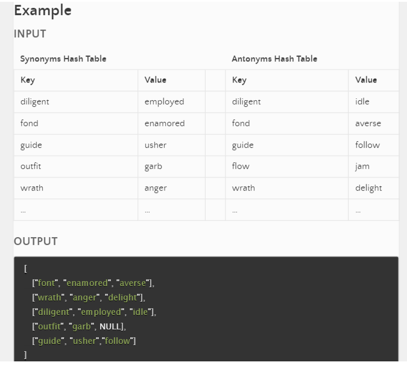

# Hash Table Implementation - Code Challenge 30


## Approach & Efficiency

My approach for the hash function was the sum the ascii values of characters, while also multplying each character by its index position in the key. This prevents us from having hash collisions for keys that aren't the same, but are permutations of the same characters. 

My approach for handling hash collisions was to implement a Linked-List data structure to store every key that has the same hash. This way if there is a collision, we can linearly traverse the linkedlist at the index of the hash that collided. This leaves us with a constant O(1) set operation and a O(c) get operation, where 'c' is the length of the linkedlist for all collisions at a particular index.


## Features

Implement a Hashtable Class with the following methods:

```set(key, value)```

- Arguments: key, value
- Returns: nothing
- This method should hash the key, and set the key and value pair in the table, handling collisions as needed.
- Should a given key already exist, replace its value from the value argument given to this method.

```get(key)```

- Arguments: key
- Returns: Value associated with that key in the table

```contains(key)```

- Arguments: key
- Returns: Boolean, indicating if the key exists in the table already.

```keys()```

- Returns: Collection of keys
hash
- Arguments: key
- Returns: Index in the collection for that key


## Testing

- Setting a key/value to your hashtable results in the value being in the data structure
- Retrieving based on a key returns the value stored
- Successfully returns null for a key that does not exist in the hashtable
- Successfully returns a list of all unique keys that exist in the hashtable
- Successfully handle a collision within the hashtable
- Successfully retrieve a value from a bucket within the hashtable that has a collision
- Successfully hash a key to an in-range value

# Hashmap Repeated Word - Code Challenge 31

## Feature Tasks

Write a function called repeated word that finds the first word to occur more than once in a string
- Arguments: string
- Return: string

## Structure and Testing

Utilize the Single-responsibility principle: any methods you write should be clean, reusable, abstract component parts to the whole challenge. You will be given feedback and marked down if you attempt to define a large, complex algorithm in one function definition.

Write at least three test assertions for each method that you define.

Ensure your tests are passing before you submit your solution.

Example
Input - ```"Once upon a time, there was a brave princess who.."```
Output - "a"

Input - ```"It was the best of times, it was the worst of times, it was the age of wisdom, it was the age of foolishness, it was the epoch of belief, it was the epoch of incredulity, it was the season of Light, it was the season of Darkness, it was the spring of hope, it was the winter of despair, we had everything before us, we had nothing before us, we were all going direct to Heaven, we were all going direct the other way – in short, the period was so far like the present period, that some of its noisiest authorities insisted on its being received, for good or for evil, in the superlative degree of comparison only..."```
Output - "it"

Input - ```"It was a queer, sultry summer, the summer they electrocuted the Rosenbergs, and I didn’t know what I was doing in New York..."```	
Output - "summer"


# Hashmap Left Join - Code Challenge 33

## Feature Tasks

Write a function that LEFT JOINs two hashmaps into a single data structure.

Write a function called `left_join()`
- Arguments: two hash maps
- The first parameter is a hashmap that has word strings as keys, and a synonym of the key as values.
- The second parameter is a hashmap that has word strings as keys, and antonyms of the key as values.
- Return: The returned data structure that holds the results is up to you. It doesn’t need to exactly match the output below, so long as it achieves the LEFT JOIN logic

NOTES:

Combine the key and corresponding values (if they exist) into a new data structure according to LEFT JOIN logic.
LEFT JOIN means all the values in the first hashmap are returned, and if values exist in the “right” hashmap, they are appended to the result row.
If no values exist in the right hashmap, then some flavor of NULL should be appended to the result row.

