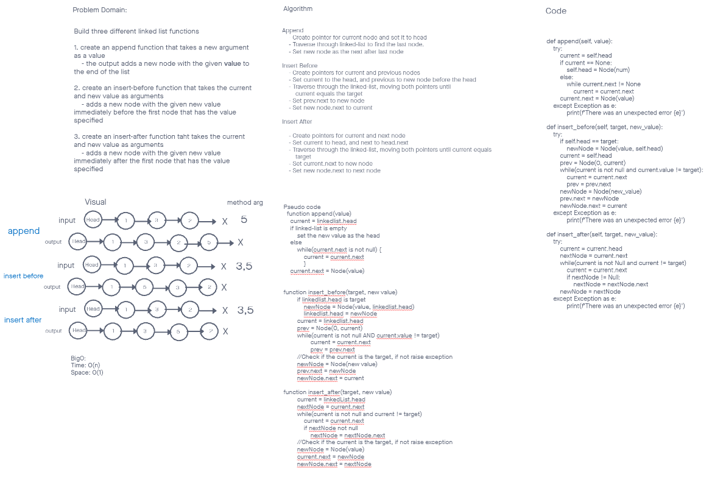
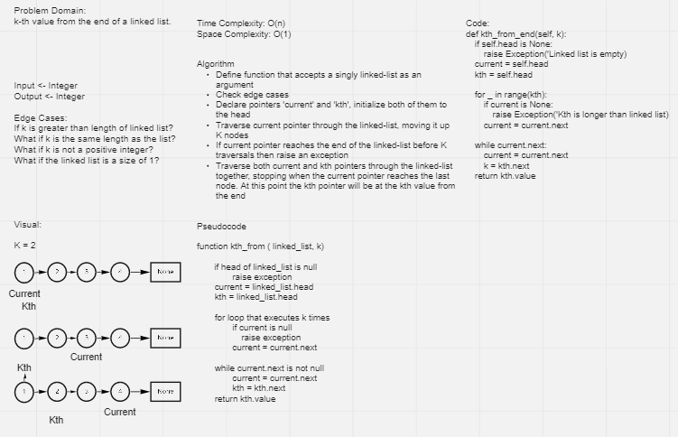
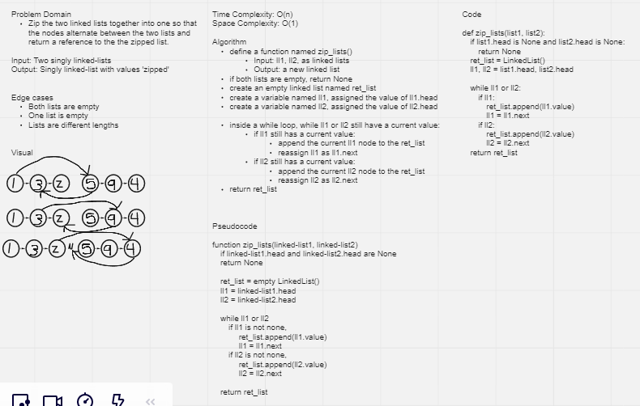

# Singly Linked List
A linked list is a sequence of data structures, which are connected together via links.

Linked List is a sequence of links which contains items. Each link contains a connection to another link. Linked list is the second most-used data structure after array.
[Source - tutorialspoint.com](https://www.tutorialspoint.com/data_structures_algorithms/linked_list_algorithms.htm)

### Code Challenge 5 - Initial Linked List Implementation ###

I tested the following functionality with Pytest
- Can successfully instantiate an empty linked list
- Can properly insert into the linked list
- The head property will properly point to the first node in the linked list
- Can properly insert multiple nodes into the linked list
- Will return true when finding a value within the linked list that exists
- Will return false when searching for a value in the linked list that does not exist
- Can properly return a collection of all the values that exist in the linked list


### Code Challenge 6 - Append, Insert-before, Insert-After ###



Code Challenge 6 Tests
- Can successfully add a node to the end of the linked list
- Can successfully add multiple nodes to the end of a linked list
- Can successfully insert a node before a node located i the middle of a linked list
- Can successfully insert a node before the first node of a linked list
- Can successfully insert after a node in the middle of the linked list
- Can successfully insert a node after the last node of the linked list

### Code Challenge 7 - Kth-from-end ###


Code Challenge 7 Tests
- Get kth from end where k is greater than the length of the linked list
- Get kth from end where k and the length of the list are the same
- Get kth from end where k is not a positive integer
- Get kth from end where the linked list is of a size 1
- Get kth from end in “Happy Path” where k is not at the end, but somewhere in the middle of the linked list

### Code Challenge 8 - Zip two linked lists ###


Code Challenge 8 Tests
- Zip lists of the same length
- Zip lists when list1 is longer
- Zip lists when lsit2 is longer
- Zip lists when either list is null
## API
```insert(val)```
- Arguments: value
- Returns: nothing
- Insert a node to the front of a Linked-List
- Time Complexity: O(1)
- Space Complexity: O(1)

```includes(val)```
- Arguments: value
- Returns: Boolean
- Indicates whether that value exists as a Node’s value somewhere within the list.
- Time Complexity: O(n)
- Space Complexity: O(1)

```to_string()```
- Arguments: none
- Returns: a string representing all the values in the Linked List, formatted as:
"{ a } -> { b } -> { c } -> NULL"
- Time Complexity: O(n)
- Space Complexity: O(n)

```append(val)```
- Arguments: new value
- Adds a new node with the given value to the end of the list
Time Complexity: O(n)
Space Complexity: O(1)

```insert_before(target, new_val)```
- Arguments: value, new value
- Adds a new node with the given new value immediately before the first node that has the value specified
- Time Complexity: O(n)
- Space Complexity: O(1) 

```insert_after(target, new_val)```
- Arguments: value, new value
- Adds a new node with the given new value immediately after the first node that has the value specified
- Time Complexity: O(n)
- Space Complexity: O(1)

```kth_from_end(k)```
- Arguments: a non negative integer.
- Returns: The node’s value that is k places from the tail of the linked list.
- Return the node’s value that is k places from the tail of the linked list
- Time Complexity: O(n)
- Space Complexity: O(1)

```zip_lists(list1, list2)```
- Arguments: 2 linked lists
- Return: New Linked List, zipped as noted below
- Zip the two linked lists together into one so that the nodes alternate between the two lists and return a reference to the the zipped list.
    - List 1 - ```[1] -> [3] -> [2] -> null```
    - List 2 - ```[5] -> [9] -> [4] -> null```
    - Output List - ```[1] -> [5] -> [3] -> [9] -> [2] -> [4] -> null```
- Time Complexity: O(n)
- Space Complexity: O(1)
