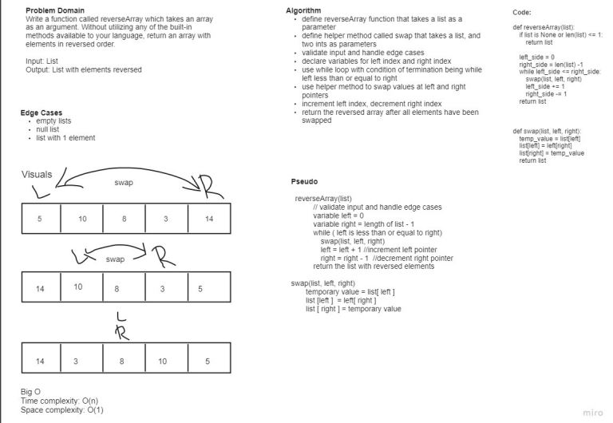

# Reverse an Array
Write a function called reverseArray which takes an array as an argument.
Without utilizing any of the built-in methods available to your language, return an array with elements in reversed order.

## Whiteboard Process

## Approach & Efficiency
We took an iterative approach using two pointers. One pointer started at the left of the list and another pointer started at the right of the list. We swap these 2 values then increment the left pointer and decrement the right pointer. This repeats in a loop until while the left is still less than or equal to the right  

Time Complexity: O(n)
Space Complexity: O(1)