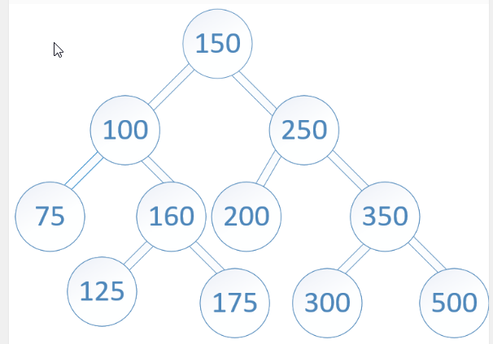
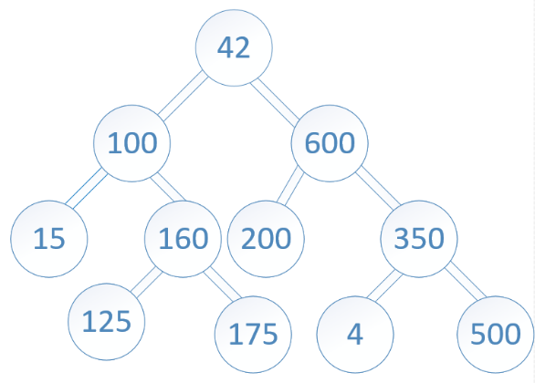

# Code Challenge 32 - Tree Intersection

Find common values in 2 binary trees.

## Feature Tasks

Write a function called tree_intersection that takes two binary trees as parameters.
Using your Hashmap implementation as a part of your algorithm, return a set of values found in both trees.

Testing 
- Tested intersection for two trees
- Tested one empty tree returns no intersection
- Tested two trees with no commons values returns no intersection


## Input 






Output:

```100,160,125,175,200,350,500```