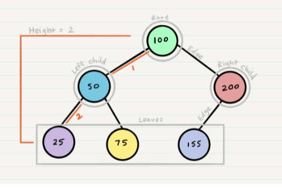

# Trees



A tree is non-linear and a hierarchical data structure consisting of a collection of nodes such that each node of the tree stores a value, a list of references to nodes (the “children”).

Binary Search Trees are a special type of tree with the property that the left child, and every node in the left subtree of a node has a value that is less than the node's value. Additionally, the right child, and every node in the right subtree of a node has a value that is greater than the node's value.

--- 

## Challenge

### Node ###

Create a Node class that has properties for the value stored in the node, the left child node, and the right child node.

### Binary Tree ###

Create a Binary Tree class

Define a method for each of the depth first traversals:
```pre_order()```
- Arguments: nothing
- Returns: An array of the values, ordered by pre-order traversal

```in_order()```
- Arguments: nothing
- Returns: An array of the values, ordered by in-order traversal

```post order()``` 
- Arguments: nothing
- Returns: An array of the values, ordered by in-order traversal

Any exceptions or errors that come from your code should be semantic, capture-able errors. For example, rather than a default error thrown by your language, your code should raise/throw a custom, semantic error that describes what went wrong in calling the methods you wrote for this lab.

### Binary Search Tree ###

Create a Binary Search Tree class

This class should be a sub-class (or your languages equivalent) of the Binary Tree Class, with the following additional methods:

```add()```
- Arguments: value
- Return: nothing
- Adds a new node with that value in the correct location in the binary search tree.

```contains()```
- Argument: value
- Returns: boolean indicating whether or not the value is in the tree at least once.


---

## Features Tested ##
- [X] Instantiate empty tree
- [X] Instantiate tree with one node
- [X] Add left child to BST
- [X] Add right child to BST
- [X] Add root node to BST
- [X] Preorder Traversal
- [X] Preorder traversal on empty BST
- [X] Postorder traversal 
- [X] Postorder traversal on empty BST 
- [X] Inorder traversal
- [X] Inorder traversal on empty BST
- [X] BST contains value in left subtree
- [X] BST contains value in right subtree
- [X] BST contains value in root node
- [X] BST value not contained in tree


# Code Challenge 16 Summary

Write the following method for the Binary Tree class

    ```find_max()```
- Arguments: none
- Returns: number
Find the maximum value stored in the tree. You can assume that the values stored in the Binary Tree will be numeric.

## Approach & Efficiency

I used an iterative approach to solve this with a in-order traversal. I mostly did this to get some practice with iterative traversals because I struggle with them a lot more than recursive solutions. The time complexity is O(n) because we have to touch each node in the tree, and the space complexity is O(n) because in the worst case (the tree is a linked-list shape) we will need to store all the nodes in the stack.        


